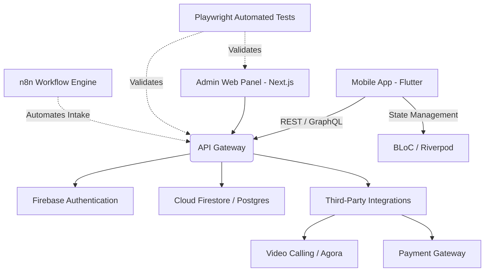

# Product Requirements & Architecture Document: Maternal Wellness Platform

## 1. Product Vision & Strategy

A holistic maternal wellness platform combining medical precision with emotional empathy to guide expectant and new mothers from preconception to postpartum. The platform shifts the focus from transaction-heavy tracking to mindful, reassuring, and data-backed companionship.

**Core Objectives:**

- Reduce maternal stress through mindful interventions (yoga, breathing, sleep guidance).
- Deliver evidence-based, medically verified developmental tracking.
- Provide direct access to lactation consultants, pediatricians, and wellness experts.
- Foster a safe, inclusive community environment.

## 2. Epics & Core Features (Product Backlog)

Structured for seamless sprint execution and backlog grooming:

### Epic 1: User Onboarding & Profiling
- Secure signup/login (Phone/OTP, Google, Apple).
- Progressive profiling (Due date, current pregnancy stage, specific health goals).
- Optional biometrics integration for secure health data access.

### Epic 2: The Womb Care Module (Prenatal)
- Week-by-Week Tracker: Visual graphics of fetal development and maternal changes.
- Vitals Monitoring: Blood pressure, weight, and kick-counter inputs.
- Mindfulness & Bonding: Garbh Sanskar principles, guided meditation, and fetal learning (music and reading).
- Fitness & Nutrition: Daily prenatal yoga videos and trimester-specific diet charts.

### Epic 3: The Fourth Trimester & Beyond (Postpartum)
- Baby Care Trackers: Integrated dashboard for sleep, feeding (breast, bottle, pump), and diaper logs.
- Maternal Recovery: Postpartum diet plans and gentle recovery exercises.
- Milestone Mapping: Month-by-month cognitive and physical developmental guides.

### Epic 4: Expert Access & Community
- Live AMAs: Scheduled video/audio rooms with doctors and specialists.
- 1-on-1 Consultation: Appointment booking system.
- Community Forums: Interest and due-date-based support groups.

## 3. Technology Stack & Infrastructure

Designed for scalability, cross-platform reach, and maintainability.

- **Frontend Mobile (Cross-Platform):** Flutter (Dart) utilizing a Clean Architecture pattern (Presentation, Domain, Data, Infrastructure layers).
- **State Management:** BLoC, Riverpod, or GetX for predictable state flow.
- **Backend & Cloud:** Firebase (Authentication, Firestore, Cloud Functions) combined with Node.js for specialized routing.
- **Web/Admin Dashboard:** Next.js (React) and TypeScript.
- **Workflow Automation:** n8n for automating provider onboarding, client intake provisioning, and marketing notifications.
- **Integrations:** Apple Health and Google Fit APIs for wearable data syncing.

## 4. Test Automation & Quality Assurance Strategy

To ensure zero defects in critical health data monitoring, testing will follow a robust shift-left approach:

- **End-to-End & Integration Testing:** Core user flows (signup, booking consultations, telehealth sessions) mapped out and automated using Playwright to ensure seamless cross-browser web execution and API reliability.
- **Automated CI/CD:** GitHub Actions integrated with Firebase App Distribution, running automated smoke tests on every PR.
- **Performance & Crash Monitoring:** Firebase Crashlytics to monitor ANRs and exceptions in real-time.

## 5. System Architecture Flow

## 6. Implementation Next Steps for Claude Code

1. Initialize Workspace: Use this document to instruct Claude Code to scaffold the Flutter project and Next.js admin repository.
2. Scaffold Architecture: Generate the Clean Architecture folders (domain, data, presentation) in the Flutter codebase.
3. Establish Workflows: Map out initial n8n webhook triggers for user registration events.
4. Setup QA Suite: Initialize the Playwright configuration in the root repository for parallel UI testing.
